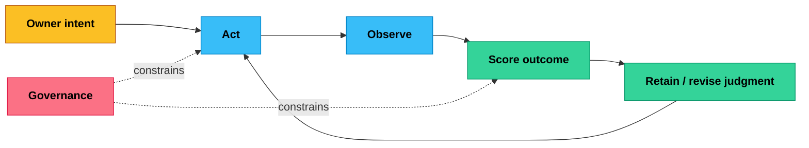
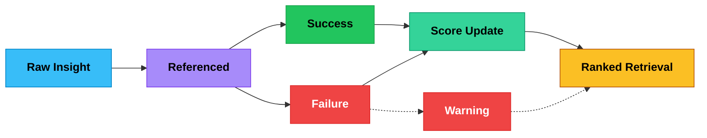
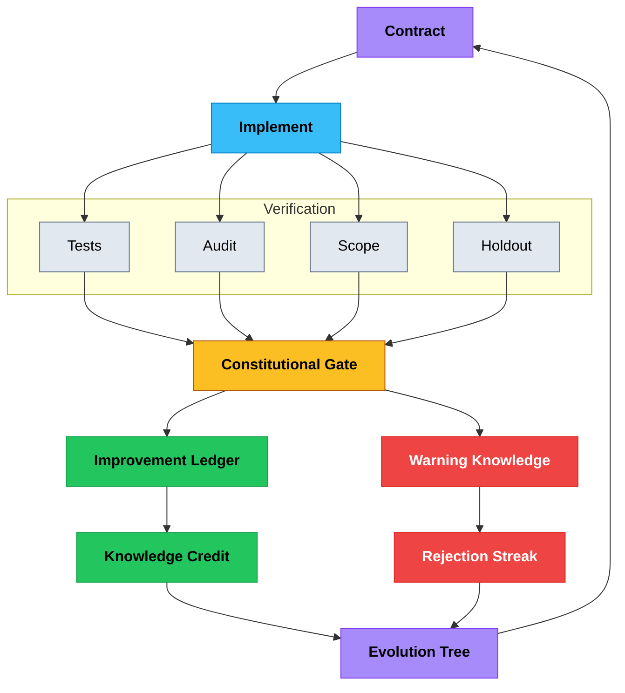
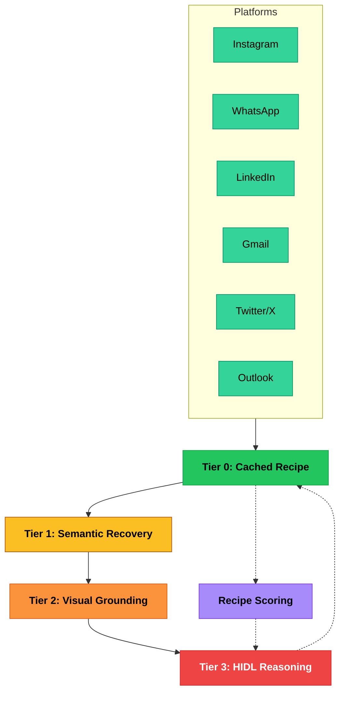
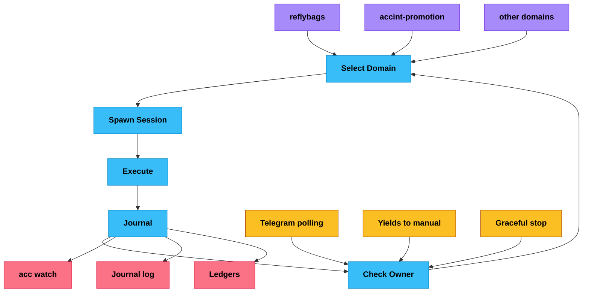

# Accreted Intelligence: An Architecture for Systems That Get Wiser

*Governed externalized judgment that compounds through contact with reality*

> **Foundational redesign in flight.** A breaking-change-forward design spec — [docs/architecture/foundational-redesign-20260503.md](architecture/foundational-redesign-20260503.md) — proposes three reductions to the architecture this whitepaper describes: TaskFrame / ActionFrame protocol collapse, a single verifier-linked continuation controller, and a unified action ledger with Brier-calibrated outcome scoring. The thesis below (state-comes-first, reality-does-the-scoring, model-as-transient-processor) is preserved and structurally strengthened. The bundle envelope, the three continuation gates, and the four parallel scoring stores are sunset. Read the redesign doc for the deletion list, phase ordering, and citations to ReAct, Tree of Thoughts, Reflexion, Voyager, LATM, MemGPT, Constitutional AI, AlphaGeometry, AlphaProof, ARES, eRAG, and ACT-R/Soar.

## Abstract

AI systems can perform impressive tasks, but they still lack the thing that makes people and institutions durable: accumulated judgment. Each session starts close to zero. What worked, what failed, and what should be avoided is rarely retained in a form that can govern the next decision.

This paper presents AccInt, an architecture that moves learning out of model weights and into scored external state: knowledge, warnings, memory, directives, proofs, and outcomes that persist across sessions, models, and system upgrades. The system improves by acting, observing results, assigning credit, and updating that state — while the model remains a replaceable processor rather than the locus of intelligence.

We call this *accreted intelligence*: a governed loop that becomes more reliable through contact with reality, without disappearing into opaque retraining. If this pattern holds, one person can operate with the accumulated judgment that previously required an institution.

The loop is the architecture. Owner intent starts each cycle. Actions touch reality. Outcomes get scored. Judgment is retained or revised. Governance constrains both action and scoring so the system can't weaken its own rules. Each cycle deposits another layer of tested judgment — and the next cycle reads it.

## 1. The Ephemeral Intelligence Problem

The central unsolved problem in AI is not generating outputs but accumulating reliable judgment across time.

A model that scores 90% on a benchmark today will score 90% again tomorrow — not 91%. It does not learn from deployment. It does not track which of its outputs led to good outcomes. It does not remember that a particular approach failed last week with a particular kind of person. It generates intelligence and immediately discards it.

This is not a memory problem. Retrieval-augmented generation, vector databases, and fine-tuning all address *recall* — getting previously seen information back into context. But recall is not judgment. Judgment requires knowing not just what happened but *what worked*. It requires scoring: this approach succeeded here, failed there, works in this context but not that one. Without scoring, memory is a pile of facts with no sense of what matters.

In reinforcement learning, this is the credit assignment problem (Sutton & Barto 2018): when something goes well, which past decision deserves the credit? When something goes wrong, which decision caused it? Deployed AI systems do not solve this. They produce outputs, observe nothing about consequences, and start fresh.

The cost is enormous. Every system that cannot accumulate judgment must *buy* that judgment fresh with every session — in tokens, in time, in repeated mistakes. An AI assistant that has helped negotiate fifty partnerships starts the fifty-first with no advantage over the first. An AI researcher that has explored a domain for weeks cannot tell a new session which leads were dead ends. The most valuable thing produced in an AI interaction — the judgment about what worked — is the first thing discarded.

Existing approaches treat this as a retrieval problem because retrieval is tractable within current architectures. But the real question is not "how do we remember?" It is "how do we score?" And even scoring alone is not enough. A system can store perfectly scored knowledge and still ignore it — if retrieval is optional and ad hoc, the model can satisfy its task without consulting what the system already knows. The deepest bottleneck is not recall, not scoring, but *retrieval-to-action binding*: making accumulated judgment behaviorally mandatory rather than passively available. What is needed is not a better memory system but a different relationship between intelligence, time, and decision-making.

## 2. Intelligence as Accretion

Consider DNA. DNA does not think or plan. It is a scored record of what survived contact with reality — accumulated over billions of years of variation, testing, and selective retention. Organisms are temporary processors: they express the genome, meet the environment, and either succeed or fail. Successful patterns propagate. Failed ones are eliminated. The information substrate outlives every individual organism that passes through it.

The intelligence is in the genome, not in the organism.

That is the inversion this paper cares about. Most AI systems treat the model as the intelligence and state as supporting material. Accreted intelligence flips that. The state holds the tested judgment. The model is the temporary processor that reads it, extends it, and moves on.

**Accreted intelligence** is a system architecture where intelligence lives primarily in scored, tested state — built up through repeated contact with reality — rather than inside any particular model. The defining properties:

1. **State comes first.** The scored state determines what the system knows, what it avoids, and what it tries next.

2. **Reality does the scoring.** Entries rise or fall based on observed outcomes, not on what a designer guessed would matter.

3. **The system improves by acting, observing, and updating** — not by retraining a model every time it learns something useful.

4. **Failure counts as knowledge.** Failures are stored as explicit, scored warnings — not discarded or averaged away. A system that forgets its mistakes becomes overconfident very quickly (Wiener 1948).

That shift matters because reasoning is getting cheaper. Judgment is not. If models become interchangeable, the scarce thing is the tested state they work against. This architecture treats reasoning as the renewable input and judgment as the compounding asset.

## 3. Architecture of Scored State

An accreted intelligence system requires four capabilities: observe, act, score, and retain.

The fundamental loop: act in the world — observe the outcome — score the action-outcome pair — retain high-scoring patterns, decay low-scoring ones. Each cycle deposits another layer of tested judgment. Over time, the layers accumulate into a substrate that increasingly constrains and improves the system's behavior — not through rules imposed from outside, but through evidence accumulated from within.

### Symbolic Handles and Context Membrane

As scored state grows, a naive architecture that dumps all accumulated state into the brain's context window at session start becomes untenable. The volume overwhelms the processor; worse, irrelevant context degrades reasoning quality. Reproduction of the Retrieval in Long-context Model (RLM) findings (Xu et al. 2025) confirms that retrieval accuracy degrades monotonically with context length and retrieval depth beyond a shallow threshold.

AccInt addresses this with a *handle board* architecture inspired by RLM principles. The brain's initial session context — delivered via `acc_pulse` — contains only symbolic handles: compact metadata descriptors (scope name, entry count, freshness timestamp, relevance score) rather than full state dumps. The brain then uses `acc_read` to drill into specific scopes on demand, pulling only the state it actually needs. This inverts the traditional pattern: instead of presenting everything and hoping the model finds what matters, the system presents a map and lets the model navigate to specifics.

The pulse itself is structured as a handle board:

- **Workspace metadata** — timestamp, compact counts of entities/knowledge/warnings
- **Handles map** — per-scope descriptors with entry counts and freshness indicators
- **Objective metadata** — active goal, progress indicators, strategy type
- **Judgment packet** — only the highest-ranked scored entries relevant to the current task

No platform details, audit breakdowns, or score distributions appear in the initial context. The brain requests those through targeted `acc_read` calls only when its reasoning requires them.

For directed sessions — where the owner has given a specific task — the context is compressed further: only the directive, session metadata, judgment packet, and available scopes for on-demand retrieval. This aggressive compression means that directed sessions carry roughly constant context size regardless of how large the scored state has grown.

A *context membrane* governs what enters the brain's working context and when. The membrane operates at four tiers:

1. **Working memory** — always visible: active directive, session state, iteration capsule, judgment packet
2. **Task context** — per-directive: relevant entities, domain model, pending outcomes for this objective
3. **Long-term state** — handles only: full knowledge base, all entities, historical trajectories, accessible via `acc_read`
4. **Meta-policy** — governance constraints, constitutional rules, scoring parameters

The membrane uses *structural scope admission*: each item carries a typed `context_scope` (global, workspace, or session) and the membrane admits by scope kind — not by text matching or regex patterns. Semantic relevance filtering is handled separately by the judgment packet, which uses embedding-based search to compile task-relevant scored entries. This separation is deliberate: the membrane handles structural access control, the judgment packet handles semantic relevance.

Tool-level directive gating provides an additional compression layer: during directed sessions, scopes irrelevant to the active directive (portfolio-level summaries, owner preference history, contract backlogs, broad focus state) are suppressed from the brain's available tool responses via a live `ACC_DIRECTIVE_ACTIVE` environment variable. The brain can still request them explicitly, but they do not appear in default tool output. This prevents context pollution — the common failure mode where a brain session intended to execute a specific task drifts into reviewing unrelated state.

### Scoring

Each knowledge entry has a score and a confidence level. The score answers: how often has this worked? The confidence answers: how much evidence do we have? AccInt uses a Bayesian Beta posterior for this — a standard way to reason under uncertainty (Thompson 1933). In plain terms, the system tracks wins and losses, then ranks knowledge by both success rate and amount of evidence.

That distinction matters. An approach that worked 8 times out of 10 should rank above one that worked 1 time out of 1, even though both look strong at first glance. AccInt doesn't just ask whether something worked. It asks how sure it should be.

Judgment also has to age. If a piece of knowledge isn't used or revalidated for long enough, the system reduces its confidence without deleting it. Fresh evidence can restore it quickly. That keeps the system from treating old assumptions as permanent truth. The system continuously reduces surprise by updating its beliefs from evidence — what Friston (2010) calls free energy minimization applied at the level of practical judgment rather than sensory prediction.

The crucial move is not storing notes but turning outcomes into ranked judgment. The following shows how knowledge flows through the scoring pipeline:

Credit and usage are deliberately separated. Referencing knowledge increments usage; later, when outcomes are observed, credit flows back as success or failure updates to the posterior. This separation matters because real-world outcomes are often delayed — a partnership approach tried today may only show results weeks later. Warning knowledge is first-class: failed approaches become explicit scored entries that influence future retrieval, preventing the delusional optimism of a system that only remembers successes.

**Provenance chains.** The knowledge schema carries explicit lineage metadata — `KnowledgeProvenance` — that records where each entry came from and how it was derived. The `derived_from` field links to parent entries; `derivation_method` classifies the transformation (observation, synthesis, abstraction, contradiction); `save_receipt_id` ties the entry to the specific save operation that created it; and `iteration` records which brain cycle produced it. The type infrastructure is fully in place; population of these fields depends on the brain consistently supplying them during save operations, which is the norm for well-formed sessions but is not yet enforced by a hard save-time constraint. When populated, the lineage makes the observation-to-insight-to-rule-to-law progression explicit and auditable:

- **Observation** — raw outcome from a single action (e.g., "Store X responded positively to warmth-first outreach")
- **Insight** — pattern derived from multiple observations (e.g., "Premium stores respond better to warmth-first outreach")
- **Rule** — tested generalization with high confidence (e.g., "Lead with warmth, not credentials, for premium retail")
- **Law** — durable principle that has survived many cycles and edge cases (e.g., "Social proof matters more than feature lists in premium B2B")

Each level in this hierarchy carries a link to its derivation sources. When a rule is challenged by new evidence, the system can trace back through the chain to the original observations, re-evaluate the intermediate insights, and update or demote the rule with full context. This lineage also enables the brain to report `handles_consumed` in its save operations — a record of which specific scored entries it actually read and used during a session. The next pulse surfaces the prior iteration's consumption pattern, allowing the system to track which state is actively load-bearing versus which state is accumulating without influence.

Recent work on model harnesses confirms that system performance depends materially on the external code that stores, retrieves, and presents information to the model — not only on model weights (Lee et al. 2026). Scoring alone is necessary but not sufficient. AccInt compiles a *judgment packet* for each session — a ranked set of scored entries relevant to the current task, selected by tag match, concept overlap, and recency. The brain is expected to cite, use, or explicitly dismiss each entry before planning, and save operations record whether the packet was reviewed. Currently the system flags missing review as a warning rather than blocking the save; the intent is to tighten this into a hard gate as the mechanism matures. Even as a soft constraint, the judgment packet materially changes session behavior: scored entries surface in the brain's working context rather than remaining buried in retrievable state, shifting the default from passive availability toward active consultation.

Outcome verification also requires separating *recipient proof* from *delivery proof*. Confirming that the system addressed the right target is not the same as confirming that a message was actually delivered. AccInt requires both: identity verification proves the action was directed correctly, and artifact-level send proof confirms a durable outcome was created. Systems that conflate these can report success while accomplishing nothing.

*Intelligence that scores what works, remembers what doesn't, and binds both to the next decision.*

### Entity Tracking

Entities — people, organizations, platforms — are not static records but evolving models with scored relationship attributes. Each entity carries interaction history, relationship state, channel preferences, and behavioral patterns derived from observed outcomes. The system does not just know *who* — it knows *how* to engage with whom, scored by results.

Scored relationship models give the brain concrete, queryable signals for each entity at two levels:

**Summary signals** — flat scored fields on the entity record for fast querying:

- **Channel scores** (`channel_scores`) — a per-platform fit score (e.g., `{"whatsapp": 0.9, "linkedin": 0.4}`) derived from observed response rates and engagement quality. The brain uses these to pick the highest-yield channel for each contact rather than relying on generic platform heuristics.
- **Responsiveness score** (`responsiveness_score`) — a 0-1 scalar reflecting how reliably the entity responds across channels. This feeds directly into follow-up timing: high-responsiveness entities get tighter follow-up windows; low-responsiveness ones get longer gaps before re-engagement.
- **Trust trajectory** (`trust_trajectory`) — one of `building`, `established`, `declining`, or `unknown`. Tracks the directional trend of the relationship, not a point-in-time snapshot. A `declining` trajectory triggers the brain to investigate root causes before further outreach.
- **Engagement pattern** (`engagement_pattern`) — one of `active`, `passive`, or `dormant`. Classifies the entity's current interaction posture. `dormant` entities are deprioritized for outreach; `active` ones surface higher in workstream scheduling.

**Structured relationship beliefs** (`relationship_beliefs`) — a deeper layer where each dimension carries not just a score but also confidence, observation count, and last-updated timestamp. This makes relationship judgment Bayesian: early observations have low confidence and shift easily; mature beliefs backed by many observations are stable and high-confidence. The belief dimensions are:

- **Channel fit** — per-platform scored beliefs (replacing flat `channel_scores` with richer signal over time). Each channel carries its own confidence and observation count.
- **Responsiveness** — how reliably the entity responds, with confidence that grows as more interactions are observed.
- **Trust level** — a continuous 0-1 trust estimate that complements the categorical `trust_trajectory`. Enables finer-grained trust-sensitive decisions.
- **Resistance level** — how much friction or pushback the entity typically shows. High resistance with high confidence signals that the brain should change approach or deprioritize.
- **Follow-up timing** — the optimal interval between contacts, expressed as a scored belief. The score represents days/30 (so 0.233 = ~7 days). Confidence grows as the system observes which timing intervals produce responses.

Beliefs are updated incrementally from interaction outcomes: each new observation blends into the existing estimate with weight proportional to `1/(uses+1)`, so early observations shift the estimate significantly while later observations refine it. Confidence asymptotes toward 1 as observation count grows. The brain can also set beliefs directly during save operations when it has strong evidence from a single interaction.

These fields are populated and updated by the brain during save operations as interaction evidence accumulates. They are queryable through `acc_read({scope:"entity"})` and surface in the session projection's judgment packet when relevant to the current task.

### Trajectory Learning

The system records not just what worked but the *sequence* that worked — which steps, in which order, produced which outcomes. Trajectory entries carry optional episode lineage (`episode_id`, `action_id`, `parent_action_id`) that builds a causal credit DAG. The lineage infrastructure is implemented and outcomes can be attributed to originating actions; automated propagation of credit scores back through the DAG is the next engineering step, not yet a live runtime mechanism. Automated sequence replay from trajectory patterns is likewise a research target rather than current behavior.

### Negative Experience

Explicit records of what failed and why. These are scored warnings that prevent the system from re-deriving failures that previous sessions already encountered. "This approach triggers resistance in this context" is knowledge that no amount of general reasoning would produce — it can only come from observed outcomes in specific situations.

### Owner Intent as Compiled State

Owner communication — from terminal or Telegram — enters through a single canonical owner-event ledger with typed `declared_semantics`: structured intent (task/research), urgency, focus overrides, learning signals (correction/approval), and domain lifecycle mutations. A typed `DirectiveEnvelope` is compiled once at ingress — action type, urgency, entity references, domain references, and embedding vector — then threaded through session projection into world-model assembly, context membrane, and contract relevance. No regex, no language-specific patterns — intent is declared at ingress, not inferred from text. This makes the system language-universal: it works identically whether the owner speaks English, Russian, Portuguese, or Mandarin.

Objective strategy is also compiled state. Each objective carries typed strategy fields — segments with priority and value propositions, channel policies (discovery order, closing channels), and approach policies — in the objectives state. the brain reads compiled strategy through `acc_read({scope:"focus"})`, not from prompt files. Strategy evolves through outcome-linked learning: the brain can propose typed strategy revisions (new segments, channel reordering, approach updates) backed by evidence, closing the loop from observation to durable policy change.

### Self-Improvement Under Governance

The self-improvement mechanism is a governed engineering loop — not free-form self-modification:

Every proposed improvement must survive multi-layered verification and an immutable constitutional gate before it takes effect. Improvements that pass are recorded with mechanism evidence in a durable ledger, and their linked knowledge entries receive credit. Improvements that fail become scored warnings — negative experience that prevents repeating the same mistake. The evolution tree tracks lineage across candidates, using posterior-aware selection to balance exploitation of proven approaches with exploration of untested ones. Intelligence grows in staircases: plateaus of knowledge accumulation punctuated by architectural jumps when a verified mechanism change lands.

*Self-improvement under constitutional constraint. Every failure teaches.*

The system does not only accumulate knowledge — it improves *how* it accumulates knowledge. Proposed improvements are written as formal contracts with clear descriptions of what should change, why, and how to verify the change worked. Constitutional gates ensure that no improvement is accepted without measured evidence of benefit. Failed proposals become scored warnings that prevent repeating the same mistake. This implements governed self-improvement: the system evolves, but within boundaries the owner controls.

The same logic applies to workflows. When a browser task succeeds repeatedly, AccInt can turn that successful trace into a replayable recipe. If the recipe keeps working, confidence rises and the system can reuse it without spending full reasoning effort each time. If performance degrades, confidence falls and the recipe is quarantined. AccInt doesn't just remember facts and strategies. It can also accrete reliable operations — and the governance rules are the same: candidate recipes must earn their confidence through observed outcomes, not through assumption.

The owner governs through directives — explicit goals, constraints, and priorities expressed in natural language. The state engine is deliberately unintelligent: it validates and stores, but never decides. All intelligence lives in the AI models and in the scored knowledge. Safety checks exist outside the code they protect, so the system cannot weaken its own constraints. Alignment is architectural (Wallace et al. 2024), not something you hope the model gets right.

## 4. Social Intelligence as Scored State

The hardest kind of judgment is social: when to reach out, what tone to use, what to say first, when to wait, and how to recover when something goes wrong. This is where many AI systems fail. They can retrieve facts and complete tasks, but they don't handle people well.

You can't evaluate social intelligence the way you evaluate factual recall. The test is human response: trust, silence, interest, discomfort, timing, status, and context. That's messy, but it's still learnable if the system treats outcomes as evidence instead of pretending one fixed social script will work everywhere.

AccInt applies the same loop here as everywhere else: act, observe, score, retain. Over time it builds evidence-backed models of what helps trust, what triggers resistance, which channels fit which relationships, and how sequences of messages land in different contexts.

**Domain model compilation.** The system builds behavioral models for each domain of interaction — not from configuration files but from accumulated evidence of what worked. Platform norms, communication timing, relationship-building patterns, and channel-specific expectations are all compiled from outcomes. A model that says "warmth before competence in this context" exists because interactions that led with warmth produced better outcomes than interactions that led with credentials.

**Relationship state as scored graph.** Each relationship carries scored attributes derived from interaction history. Response patterns, preferred channels, topics that resonate, topics that trigger resistance — all accumulated through observation. The system does not follow social scripts. It accretes social judgment specific to each relationship, scored by actual outcomes. Structured relationship beliefs give each dimension its own confidence level — the system knows not just *what* it believes about a relationship, but *how much evidence* backs that belief. This prevents overconfident social decisions based on thin evidence.

**Resistance navigation.** When social strategies fail — silence, objection, withdrawal — the failure is scored and the model updates. Interactions carry typed friction classifications (`silence`, `defer`, `objection`, `rejection`, `positive`) with explicit `follow_up_eligible` flags, enabling the brain to distinguish "not now" from "never" in its planning. Each resolved friction strengthens the model; each unresolved friction becomes a warning. The classification is brain-driven (the model reasons about response signals), not a dedicated NLU mechanism — the architecture provides the typed state substrate for friction to accrete as scored judgment.

The unification insight: factual, procedural, and social judgment all use the same mechanism — act, observe, score, retain. The scored state substrate is domain-general. A system that accretes all three forms of judgment begins to exhibit a property that has no precedent in artificial systems: it develops *wisdom* — context-sensitive judgment that improves through experience and transfers across situations.

This gets close to what Aristotle called *phronesis*: practical wisdom — learning how to act well in particular situations through experience and consequences, not just facts or rules. In AccInt, that practical wisdom lives in scored state rather than in the model by itself. Phronesis here is an architectural analogy, not a named subsystem: the system doesn't implement an explicit "practical wisdom module" but the scored-state substrate produces the functional equivalent through outcome-linked accretion.

## 5. Execution as an Accreting Cost Ladder

Accreted intelligence does not only improve judgment — it compresses the cost of acting on that judgment. AccInt operates through browser primitives across real platforms: Instagram, WhatsApp, LinkedIn, Gmail, Twitter/X, and Outlook. Each browser workflow is a potential recipe that can be learned, scored, and replayed.

The execution layer organizes into four tiers, ordered from cheapest to most expensive. Most work replays cheaply at the bottom tier. Only novel or broken workflows require expensive reasoning at the top:

The feedback loop from Tier 3 back to Tier 0 is where execution accretes. Every expensive reasoning episode that succeeds becomes a scored recipe — a proven workflow that future sessions replay without model reasoning. Over time, the system spends less to do more. This mirrors biological skill acquisition: novel actions require conscious deliberation; practiced actions become automatic. The cost of intelligence decreases as it accumulates.

**Context strategy selection.** Cost compression extends beyond execution into context assembly itself. When a directive arrives, the system selects a *ContextProgram* — a retrieval strategy chosen at directive ingress rather than at world-model compilation time. Six strategies are available:

- **peek** — read only handle metadata; sufficient when the directive is self-contained
- **grep** — structural tag match against the scored state; fast, low-token retrieval
- **subquery** — decompose the directive into sub-questions, retrieve per sub-question
- **direct** — single targeted `acc_read` for a known scope
- **partition** — split retrieval across independent scopes, merge results
- **summarize** — compress a large scope into a fixed-size summary before presenting

Strategy selection is itself a scored decision: the system tracks which strategies produced effective sessions for which directive types and biases future selection accordingly. Retrieval depth is capped at one level (the brain reads handles, then drills into at most one layer of specifics) — deeper retrieval consistently degrades performance in RLM reproduction experiments. This cap means the context assembly cost is bounded regardless of how large the scored state grows, converting a potential O(n) context cost into O(1) with respect to state size.

*Most work replays cheaply. Only novel problems require expensive reasoning.*

## 6. End-to-End: A Worked Example

The architecture above is abstract by design. To make it concrete, consider a single AccInt cycle drawn from the system's actual operating history.

**Objective compilation.** The owner sets a goal through the terminal or Telegram: contact retail stores that might carry a premium product line. The orchestrator compiles this into a world model — merging the owner directive with the active objective, owner profile, active goals, pending outcomes from prior cycles, and scored warnings. This world model becomes the brain's operating context.

**Brain reasoning.** The brain begins by calling `acc_pulse`, which returns a handle board — not a full state dump but a compact map of available scopes: entity count, knowledge count, warning count, freshness timestamps, and the active objective's metadata. Embedded in the pulse is a compiled *judgment packet* — the highest-ranked scored entries relevant to this specific task, selected by topic-key match against the directive. Before planning, the brain reviews each entry in the judgment packet: applying insights that match the current situation, dismissing ones that don't apply, and recording a structured receipt of what it used and why. This is the retrieval-to-action binding in practice — scored entries surfacing in the working context and shaping the plan rather than sitting passively in retrievable state.

The brain then navigates the handle board selectively. It calls `acc_read({scope:"entity"})` to pull models for previously contacted businesses, `acc_read({scope:"search"})` for scored outreach approaches that produced responses, and `acc_read({scope:"govern"})` for operational context including warnings and policies — each a targeted drill into a specific scope, not a broad state read. The context membrane ensures that only directive-relevant entries surface in these reads; portfolio summaries and unrelated domain state are suppressed. From this selectively assembled context, the brain selects a plan — research candidate stores via web search, verify contact channels through browser primitives, and draft messages shaped by what the scored state says works.

**Execution.** Browser primitives execute through a kernel-only dispatch stack: six kernel operations (navigate, observe, act, extract, prove, checkpoint) are called via `acc_primitive`, routed through a Python runtime that checks for scored recipes first, then dispatches to kernel primitives directly. Non-kernel primitive names (e.g. `ig_send_dm`, `wa_send_text`) are convenience aliases resolved by the TypeScript recipe runtime — when an active recipe exists, its steps compile to kernel ops; when no recipe qualifies, the system operates at Tier 3 (HIDL) using kernel ops composed by the brain. Successful execution traces are automatically captured and compiled into candidate recipes, closing the loop toward Tier 0 replay.

**Outcome observation.** the brain records outcomes through `acc_save`: entity interactions with approach details and knowledge references, knowledge credit updates, and pending outcomes for results that will only be observable later. One store responds with interest — the linked knowledge entries receive success credit. Another store responds negatively — that approach receives failure credit and becomes a scored warning. Entity models are updated with interaction history and channel preferences.

**Changed future behavior.** The next cycle that targets a similar store reads the updated state. The approach that produced interest is scored higher and more likely to surface through Thompson sampling. The approach that produced a negative response appears as a warning in the session context. The entity model for the responsive store now carries relationship context that shapes follow-up timing and tone.

**Compounding.** After dozens of such cycles, the system has accumulated scored models of businesses, tested outreach approaches across platforms, built entity-specific relationship histories, and compiled trajectory records of what works in this domain. Later cycles operate with better judgment than early ones — not because the model improved, but because the scored state grew. As trace capture matures, successful workflows will additionally compile into scored recipes that replay without model reasoning, compressing execution cost.

This example illustrates the mechanisms described in this paper operating together: Bayesian scoring, entity tracking, trajectory learning, negative experience, and governed execution. No single cycle is impressive. The compounding across cycles is.

*One cycle deposits a layer. A thousand cycles build an institution.*

## 7. Processor Independence

A critical property of accreted intelligence is that it is not bound to any particular reasoning engine.

The scored state can be read and executed against by any sufficiently capable model. Today's session uses one model; tomorrow's may use a different one. The intelligence persists because it lives in the state, not in the processor. If a model degrades, is deprecated, or is replaced by something better, the accumulated judgment continues — the tools, state schemas, and retrieval bindings are model-agnostic by design. In practice, AccInt's brain model is configurable via environment variable (`ACC_MODEL`) and can be overridden per session. The architecture supports processor swaps at the tooling level; empirical verification of no-degradation across specific model transitions is an ongoing evaluation target, not yet a measured claim.

This mirrors biological robustness. DNA survives the death of individual organisms. The genome persists while bodies come and go. In the same way, accreted intelligence survives the deprecation of individual models. Model selection becomes a cost and capability optimization, not an identity commitment.

This is what Clark and Chalmers (1998) called the *extended mind* — cognition that extends beyond the boundary of the processor — but radicalized. In the extended mind thesis, the external substrate stores information. In accreted intelligence, the external substrate *is* the intelligence. The models are not minds with external memory. They are temporary reasoning processes recruited by a persistent body of judgment.

The practical consequence: the system is not "a GPT system" or "a Claude system." It is its scored state, temporarily using whatever processor serves. This makes accreted intelligence durable across the rapid obsolescence cycles that characterize AI model development. Models are released, benchmarked, deprecated, and replaced on a six-month cadence. Accreted intelligence compounds across model generations — each new model reads the same scored state and contributes to it, layer upon layer.

Processor independence does not imply topology independence. Recent evidence shows that multi-agent decomposition can degrade performance by 30–70% on sequential reasoning tasks compared to a single capable agent (Kim et al. 2025; Su & Wu 2026). AccInt's default is single-brain-first: one brain tightly bound to the scored state, with delegation to specialist agents only for genuinely parallelizable or domain-isolated work. The intelligence lives in the scored state, not in the coordination topology. Adding more processors does not add more judgment — it adds coordination cost.

## 8. Empirical Evaluation Framework

This paper makes architectural claims, so it also needs architectural tests. If accreted intelligence is real, it should outperform stateless systems on specific, measurable dimensions over time. If it doesn't, the idea is wrong or incomplete.

### Baselines

Three comparison points represent the current state of deployed AI:

1. **Stateless LLM.** A capable model with no persistent state. Each session starts fresh. This is the dominant deployment pattern today.

2. **RAG + Memory.** A model with retrieval-augmented generation over stored documents and conversation history. Information persists, but nothing is scored by outcomes.

3. **Compound Agent.** A multi-model system with tool use, planning, and memory — but without Bayesian scoring of knowledge or explicit negative experience. This represents the current frontier of agent architectures.

### Metrics

Six measurements distinguish accreted intelligence from these baselines:

**Judgment retention.** After N sessions in a domain, present a novel situation that requires applying previously learned judgment. Measure whether the system's response quality reflects accumulated experience. Stateless systems score identically on session 1 and session 100. Accreted systems should show monotonic improvement.

**Negative experience recall.** Introduce a situation where a previously failed approach appears attractive. Measure whether the system avoids the known-bad approach and can articulate why. Systems without scored warnings will re-derive the same failures.

**Credit assignment under delay.** Take an action whose outcome is only observable after multiple intervening sessions. Measure whether the system correctly attributes the outcome to the originating action. This tests the separation between usage tracking and outcome scoring.

**Cost compression.** Measure the computational cost (tokens, time, API calls) of performing the same class of task at session 1 versus session N. Accreted systems should show declining cost as recipes accrete and judgment reduces exploration. Systems without recipe scoring show flat or increasing cost. *Current status: the recipe tier architecture and scoring exist; per-tier cost instrumentation is infrastructure that is being built, not yet measured at scale.*

**Model swap resilience.** Replace the reasoning model mid-operation. Measure the performance delta before and after the swap. Accreted systems should show minimal degradation because intelligence lives in the scored state, not in the model. Systems without externalized scored state lose whatever the previous model had learned in-context.

**Bias detection.** After operating in an environment with known biases, measure whether the scored state has encoded those biases. Then introduce corrective evidence and measure how quickly the scores update. This tests both the vulnerability to adversarial accretion and the system's capacity for self-correction through evidence. *Current status: this metric is aspirational. The scored state is externalized and inspectable, and owner governance provides manual correction, but no dedicated bias-drift detection mechanism exists yet. This remains an open research problem.*

**Cross-iteration context compression.** Measure the context size consumed by the brain at iteration N versus iteration 1 for comparable tasks. Accreted systems with iteration capsules should show roughly constant context size: each iteration receives a fixed-size capsule summarizing the prior iteration's work (iteration number, promise, save receipt ID, summary, delta counts, directive hash) rather than re-reading the full world model. Systems without capsules either truncate context (losing information) or grow context linearly with iteration count (degrading reasoning). The compression ratio — full state size divided by capsule size — is a direct measure of how efficiently the architecture converts accumulated state into actionable session context.

**Prediction residuals (active inference).** Measure the accuracy of the brain's predicted outcomes against actual outcomes over successive iterations. Each iteration capsule carries a `predicted_outcome` and `predicted_delta` — the brain's forecast of what its actions will produce. After outcomes resolve, the residual between prediction and reality is scored. Declining residuals indicate that the system is building an increasingly accurate model of its environment — the active inference loop is converging. Stable or rising residuals indicate that the environment is changing faster than the system learns, or that the scoring substrate has a systematic bias. This metric directly tests the free energy minimization principle: is the system reducing surprise about its environment through accumulated judgment?

### Preliminary Observations

AccInt already demonstrates several things at the mechanism level. **Judgment retention is implemented**: the system stores 1,400+ scored knowledge entries, reuses them in later cycles through compiled judgment packets, and updates scores when outcomes resolve. **Negative experience is implemented**: failed approaches persist as scored warnings that shape future planning. **Self-verification convergence is implemented**: executable audit invariants detect contract debt, evidence gaps, and state inconsistencies; the system repairs toward convergence rather than drifting. **Handle-board context is implemented**: pulse delivers symbolic handles rather than full state, and the brain navigates to specifics via targeted `acc_read` calls — reducing initial context size by an order of magnitude compared to the prior full-dump approach. **Save receipts with provenance are implemented**: `acc_save` returns a `SaveReceipt` with per-artifact IDs for every knowledge entry created, updated, or archived, every contract proposed, and every entity modified; knowledge entries carry `KnowledgeProvenance` linking them to their derivation sources, save receipt, and iteration number. **Iteration capsules are implemented**: cross-iteration state is compressed into constant-size capsules carrying iteration number, promise, save receipt ID, summary, delta counts, and directive hash — the brain receives prior-iteration context without re-reading the full world model. **Context strategy selection is implemented**: the ContextProgram selects among six retrieval strategies at directive ingress, with retrieval depth capped at one level per RLM findings.

**Retrieval-to-action binding is enforced**: when a session projection includes a non-empty judgment packet, `acc_save` rejects mutating saves that omit full `judgment_reviewed` coverage — the brain must cite, use, or dismiss every entry before planning. **Metadata-first owner intent is implemented end-to-end**: a typed `DirectiveEnvelope` is compiled once at ingress with action type, urgency, entity references, domain references, and embedding vector, then threaded through session projection into world-model assembly, context membrane admission, and contract relevance checks — no regex, no downstream re-derivation. **Context membrane admission is purely structural**: items carry typed `context_scope` (global, workspace, session); the membrane admits by scope kind, not by text pattern matching. Semantic relevance filtering is handled by the judgment packet via embedding-based search, not by the membrane. **Owner-value governance is enforced**: pulse surfaces an `owner_value_health` diagnostic with missing-objective detection and owner-value debt signaling; contract creation gates warn when internal-only contracts are proposed without active objectives or when owner-value is negative. **Knowledge provenance** fields exist in the schema and are populated by well-formed sessions. **Credit lineage infrastructure is implemented**: actions carry episode/step lineage that builds a causal credit DAG enabling delayed outcome attribution; automated credit propagation through the DAG is the next engineering step.

What the system has also demonstrated — through its own operational history — is that **verification integrity is fragile**. A scope-checking bug that compared the wrong diff caused an 83% false rejection rate over hundreds of self-improvement cycles, poisoning the evolution tree with false negative experience. The bug was eventually detected and repaired through the system's own audit mechanisms, but the episode illustrates that self-improving systems can corrupt their own verification tooling in subtle ways. Any serious evaluation framework must account for evaluator brittleness — the possibility that the test itself is wrong (Pan et al. 2025).

What hasn't been shown yet is the full quantitative curve. We don't yet have controlled, cross-domain experiments proving how fast judgment improves, how large the cost savings become, or how robust model swaps are in practice. That's not a flaw in the architecture — it's the next empirical job. The mechanisms exist, the hypotheses are falsifiable, and the missing work is measurement at scale.

Empirical work on model harnesses (Lee et al. 2026) provides additional evidence that harness-level changes — memory policy, retrieval logic, completion checks — can produce substantial capability gains without changing model weights. This supports treating AccInt's scored-state architecture as a first-class capability determinant, not an implementation detail around a fixed model.

*Architecture without measurement is philosophy. Measurement makes it engineering.*

## 9. Generalization and Open Frontier

The architecture described here was built for one person's work — but the principles are domain-general.

Any domain where outcomes can be observed and scored is a domain where intelligence can accrete. Medical diagnosis, scored by patient outcomes over months. Legal reasoning, scored by case results. Scientific research, scored by experimental confirmation. Education, scored by learning outcomes. Negotiation, scored by agreement quality. Community coordination, scored by engagement and retention. In each case, the same substrate — scored state accumulated through reality contact — could develop domain-specific judgment that compounds with use.

Because accreted intelligence compounds structure — scored outcomes, relationship graphs, proof chains, domain models — rather than natural-language phrasing, it is inherently language-agnostic. The same scored state substrate works whether the owner operates in English, Portuguese, Russian, or Mandarin. What compounds is not words but tested judgment about what works, and that judgment is stored in scored relations, not in any particular language's vocabulary. This is not internationalization — it is a deeper property: structure over lexicon.

The category of work most transformed is what we call *institutional work* — the kind that previously required organizations because no individual could accumulate enough judgment alone. Relationship management across hundreds of contacts. Cultural adaptation across markets. Trust-building across months of interaction. Conflict navigation that draws on scored experience with similar situations. These are functions that institutions perform through collective memory distributed across many employees. Accreted intelligence concentrates that collective memory into a personal substrate — making one person's judgment institutional in scope.

### Open Problems

If accreted intelligence is real, the research agenda is large and unsolved:

**Scoring function design.** How should outcomes be mapped to scores across domains with delayed, partial, or ambiguous feedback? Medical outcomes unfold over months; social outcomes over minutes. What is the correct scoring function for each regime?

**Convergence properties.** Under what conditions does scored state converge to stable judgment rather than oscillating or drifting? What are the formal relationships between scoring rate, decay rate, and judgment stability?

**Adversarial robustness.** Scored state that accretes from environmental feedback is vulnerable to adversarial manipulation — situations where observed outcomes are corrupted to distort scoring. What mechanisms detect and resist adversarial accretion?

**Cross-domain transfer.** When does judgment accreted in one domain transfer to another? What are the conditions for positive transfer versus harmful contamination?

**Multi-agent scored state.** Can multiple accreted intelligence systems share or merge scored state? If two systems independently accrete judgment in the same domain, is there a principled way to merge their substrates?

**Causal credit assignment.** When outcomes are delayed by weeks or months, how does the system correctly attribute credit to the actions that caused them? This is the hardest open problem in the architecture.

**Bias and governance.** A system that accretes models of human behavior inherits the biases of the environments it operates in. What mechanisms detect bias accumulation in scored state? How does governance scale as the substrate grows?

These problems are interesting enough to attract researchers, concrete enough to guide implementation, and unsolved enough to sustain a community. They are not limitations of the architecture — they are the research frontier it opens.

## 10. Continuous Autonomous Operation

Accreted intelligence that only runs when a human is watching loses most of its compounding potential. AccInt includes a continuous autonomous supervisor — OwnerAutonomy — that operates the system 24/7 across cycles, domains, and time zones without requiring constant attention.

OwnerAutonomy is deliberately not a brain. It does not make business decisions, choose communication approaches, or evaluate outcomes. It is scheduling and recovery infrastructure: it reads objectives and domain execution config from state, picks the highest-priority objective for each cycle, compiles owner events, spawns a fresh brain session, journals what happened, and applies adaptive backoff when no work is actionable. Strategy lives in compiled runtime state — objective strategy bundles, scored knowledge, and owner directives — not in prompt files. the brain reads this compiled strategy via tools (`acc_read({scope:"focus"})`) and sees structured segments, channel policies, approach rules, and value propositions rather than prose instructions.

**Cross-iteration compression.** When OwnerAutonomy spawns consecutive brain sessions for the same objective, each session after the first receives an *iteration capsule* — a constant-size summary of what the prior iteration accomplished. The capsule carries the iteration number, the promise the brain made, the save receipt ID (linking to every artifact produced), a compressed summary, delta counts (knowledge created, entities modified, outcomes recorded), and a directive hash for consistency checking. This replaces the prior pattern of re-reading the full world model at each iteration start. The brain also records a `predicted_outcome` and `predicted_delta` in each capsule — its forecast of what the next cycle's results will look like. When the next cycle arrives, it can compare actual results against prediction, scoring its own model accuracy. This active inference loop — predict, act, observe residual, update — means that OwnerAutonomy's consecutive iterations converge toward accurate environmental models rather than repeating the same exploration. The practical effect is that iteration 5 of a multi-cycle objective operates with the accumulated context of iterations 1 through 4 compressed into a fixed-size capsule, rather than either losing that context entirely or paying linear context cost to re-read it.

The owner retains full sovereignty. Manual work takes priority — OwnerAutonomy yields when the owner is active. A simple file touch provides graceful shutdown. Telegram polling keeps the owner informed between cycles. Every cycle is journaled, every state change is diffed, and the system can be observed from a second terminal while work continues:

This continuous outer loop is what transforms accreted intelligence from a session tool into a persistent institution. Each cycle deposits another layer of judgment. Overnight runs produce real outcomes that are scored by morning. Objective rotation ensures that multiple areas of work receive attention.

The control principle underlying continuous operation is active inference (Friston 2010; Parr et al. 2022): each cycle predicts an owner-approved outcome, acts to make that prediction true, observes the result, and updates the substrate that all future predictions read from. Owner corrections are prediction errors that update durable preference state. Uncertainty triggers clarification rather than silent guessing. The system minimizes surprise about what the owner will endorse — not by asking constantly, but by accreting a model of the owner's standards from observed corrections and applying it before acting.

The compounding described throughout this paper is not metaphorical — it is the literal result of an always-running, governed, journaled loop that keeps accreting judgment from reality contact.

*Your system works continuously. Every cycle governed, journaled, recoverable.*

### RLM-Inspired Design Principles

The context architecture described in Section 3 draws on empirical findings from Retrieval in Long-context Model (RLM) research (Xu et al. 2025). Three principles from that work shaped AccInt's current design:

**Principle 1: Retrieval degrades with context length.** RLM reproduction experiments show that even long-context models lose retrieval accuracy as the context window fills. Doubling context length does not double the model's ability to use that context — it often halves it. AccInt's response is the handle board: present metadata, not data. The brain's initial context is small regardless of how large the scored state has grown, and it drills into specifics only when reasoning requires them. This keeps the effective retrieval window short even as the state substrate scales.

**Principle 2: Shallow retrieval outperforms deep retrieval.** Retrieval chains deeper than one hop (retrieve A, then use A to retrieve B, then use B to retrieve C) degrade more than they help. AccInt enforces a depth cap of one: the brain reads handles in the pulse, then reads specific state through `acc_read`, but does not chain retrieval calls. The ContextProgram strategies (peek, grep, subquery, direct, partition, summarize) are all designed to resolve in a single retrieval step. This is a hard architectural constraint, not a guideline — the tool interface does not support recursive retrieval.

**Principle 3: Strategy selection matters more than context size.** Which information enters the context matters more than how much. AccInt selects a retrieval strategy at directive ingress — before the brain begins reasoning — based on directive type, available scopes, and historical strategy effectiveness. This front-loads the most consequential decision (what to retrieve) rather than leaving it to the brain's ad-hoc judgment during execution. The strategy itself is scored: if a particular strategy consistently produces effective sessions for a given directive type, it is selected with higher probability on future similar directives.

These principles unify with the accretion thesis: the handle board and context membrane are not just performance optimizations — they are necessary for the scored state to scale without degrading the processor's reasoning quality. A system that accretes thousands of knowledge entries but dumps them all into context has not actually accumulated usable judgment. Symbolic handles and directed retrieval ensure that accumulated judgment remains accessible as it grows, rather than becoming noise that drowns the signal.

## 11. Boundaries

A system that compounds judgment about human environments carries real risks.

Social intelligence models are probabilistic inferences, not certainties. Cultural and emotional hypotheses can be wrong. A system that understands how trust forms could theoretically be used to manipulate rather than to build genuine relationships. Scored state that learns from biased environments can encode and amplify those biases.

AccInt mitigates these risks architecturally. The scored state is externalized and inspectable — not hidden inside model weights. The owner can audit any knowledge entry, override any directive, and constrain any behavior. Constitutional gates enforce boundaries that the system cannot weaken from within. The engine stores but does not decide. Governance is structural, not aspirational.

A subtler risk applies to self-improving systems specifically: *verification integrity*. A system that improves its own code can inadvertently corrupt the tools that verify those improvements. AccInt has observed this in practice — a scope-checking mechanism that compared the wrong diff silently rejected valid improvements for hundreds of cycles, accumulating false negative experience that distorted future decisions. The system eventually detected and repaired the corruption through its own audit mechanisms, but the episode demonstrates that self-verification must itself be verified. Governance is not a static boundary — it is a living system that can degrade and must be maintained.

Any serious implementation of accreted intelligence must invest as heavily in governance, auditability, and boundary enforcement as in scoring and accumulation. The architecture must be governed as carefully as the intelligence is grown.

## 12. Conclusion

An intelligence that resets every session can be useful, but it can't compound. It keeps paying to rediscover what it should already know.

The architecture in this paper is a bet that this is temporary. Once systems can store tested judgment as scored state, reuse it across time, and update it from real outcomes, the center of gravity shifts. Intelligence stops being whatever happens inside one model call and becomes a persistent substrate that models read and extend.

That shift matters because accumulated judgment is worth more than regenerated cleverness. A system that keeps what reality taught it will outrun one that has to start over. The open question is no longer whether this kind of architecture is possible. It's who will build it well, measure it honestly, and govern it before everyone else has to.

---

maxbaluev@outlook.com | [Telegram](https://t.me/maxbaluev)

## References

### Foundational

- Ashby, W.R. (1956). *An Introduction to Cybernetics*. [PDF](https://archive.org/details/introductiontocy00ashb)
- Beer, S. (1984). "The Viable System Model." *JORS*, 35. [Taylor & Francis](https://www.tandfonline.com/doi/full/10.1057/jors.1984.2)
- Bush, V. (1945). "As We May Think." *The Atlantic*. [MIT](https://web.mit.edu/sts.035/www/PDFs/think.pdf)
- Clark, A. & Chalmers, D.J. (1998). "The Extended Mind." *Analysis*, 58(1). [Oxford Academic](https://academic.oup.com/analysis/article-lookup/doi/10.1093/analys/58.1.7)
- Engelbart, D.C. (1962). "Augmenting Human Intellect: A Conceptual Framework." [dougengelbart.org](https://dougengelbart.org/content/view/138/)
- Friston, K. (2010). "The free-energy principle." *Nature Reviews Neuroscience*, 11. [Nature](https://www.nature.com/articles/nrn2787)
- Popper, K. (1972). *Objective Knowledge: An Evolutionary Approach*. Oxford University Press.
- Sutton, R.S. & Barto, A.G. (2018). *Reinforcement Learning* (2nd ed.). [book](http://incompleteideas.net/book/the-book-2nd.html)
- Thompson, W.R. (1933). "On the likelihood that one unknown probability exceeds another." *Biometrika*. [JSTOR](https://www.jstor.org/stable/2332286)
- Wiener, N. (1948). *Cybernetics*. [Wikipedia](https://en.wikipedia.org/wiki/Cybernetics:_Or_Control_and_Communication_in_the_Animal_and_the_Machine)

### Harness & Runtime Architecture

- Lee, Y. et al. (2026). "Meta-Harness: End-to-End Optimization of Model Harnesses." [arXiv:2603.28052](https://arxiv.org/abs/2603.28052) · [Project](https://yoonholee.com/meta-harness/)
- Xu, P. et al. (2025). "Retrieval in Long-context Language Models: An Empirical Study." [arXiv:2512.24601](https://arxiv.org/abs/2512.24601)

### Self-Improving & Self-Evolving Systems

- Campbell, D.T. (1960). "Blind variation and selective retention in creative thought." *Psychological Review*, 67(6).
- Schmidhuber, J. (2003). "Goedel Machines." [arXiv:cs/0309048](https://arxiv.org/abs/cs/0309048)
- Zhang, X. et al. (2025). "Darwin Gödel Machine." [arXiv:2505.22954](https://arxiv.org/abs/2505.22954)
- Fang, J. et al. (2025). "A Comprehensive Survey of Self-Evolving AI Agents." [arXiv:2508.07407](https://arxiv.org/abs/2508.07407)

### Compound Systems & Social Intelligence

- Kim, S. et al. (2025). "When More is Less: Understanding Multi-Agent LLM Scaling." [arXiv:2512.08296](https://arxiv.org/abs/2512.08296)
- Luo, J. et al. (2025). "Multi-LLM Architecture." [arXiv:2507.00672](https://arxiv.org/abs/2507.00672)
- Parr, T., Pezzulo, G., & Friston, K.J. (2022). *Active Inference: The Free Energy Principle in Mind, Brain, and Behavior*. MIT Press.
- Russo, D. et al. (2018). "A Tutorial on Thompson Sampling." *FnTML*, 11(1). [arXiv:1707.02038](https://arxiv.org/abs/1707.02038)
- Su, Z. & Wu, Q. (2026). "CooperBench: Multi-Agent Cooperation Benchmark." [OpenReview](https://openreview.net/forum?id=AomNqiSwb1)
- Williams, T. et al. (2022). "Artificial Social Intelligence." *Frontiers in Artificial Intelligence*, 5. [Frontiers](https://www.frontiersin.org/articles/10.3389/frai.2022.1042921)
- Zaharia, M. et al. (2024). "The Shift from Models to Compound AI Systems." [BAIR Blog](https://bair.berkeley.edu/blog/2024/02/18/compound-ai-systems/)

### Alignment & Governance

- Pan, J. et al. (2025). "WebArena Verified: Tackling Evaluator Brittleness." [OpenReview](https://openreview.net/forum?id=94tlGxmqkN)
- Rafailov, R. et al. (2023). "Direct Preference Optimization." [arXiv:2305.18290](https://arxiv.org/abs/2305.18290)
- Satta Chiris, L. & Mishra, A. (2025). "AURA." [arXiv:2510.15739](https://arxiv.org/abs/2510.15739)
- Wallace, E. et al. (2024). "The Instruction Hierarchy." [arXiv:2404.13208](https://arxiv.org/abs/2404.13208)
